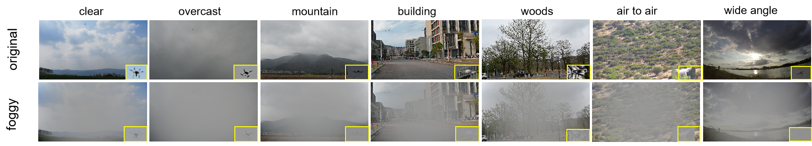
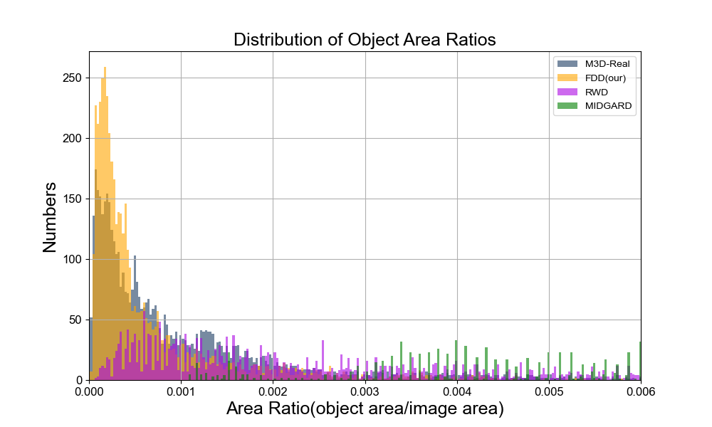

# Foggy Drone Dataset(FDD)

## Introduction
We built a dataset consisting of images of drones, the
Foggy Drone Dataset (FDD), which was designed to facil-
itate research on drone detection under foggy conditions.  Our dataset, FDD, comprises 7,187 images of only the drone class. FDD was constructed from two distinct subsets of images. Initially, we captured 5,584 images encompassing a variety of various drone types. Subsequently,we incorporated 1,603 images from drone vs. bird datasets. The FDD contains images of a diverse array of dronesand scenes, with each image presented at a resolution of 1920 × 1080 pixels. On average, each image contained a single drone.
## Sample show
Samples from the Foggy Drone Dataset constructed for this work. Top row: example images showing original views. Bottom row: their respective foggy counterparts. The drones were captured against different types of background: clear skies, overcast, mountain, building, woodland, and so on. The dataset also includes images captured from diverse camera perspectives, such as ground-to-air shots, air-to-air views, and scenes taken with a wide-angle lens.

Comparison of the object scale across various datasets. Based on the data distribution shown in the figure, it is evident that our FDD dataset contains more small objects compared to other datasets, which undoubtedly increases the difficulty of detection. We randomly selected 5,000 objects from various datasets to construct this graph. For the FDD dataset, 62% of the size of objects are smaller than 0.05% of the image area, while M3D-Real has 44% of objects below this threshold. In contrast, Real-World and MIDGARD only have 6% and 3% of objects, respectively, that are smaller than 0.05% of the image area.

## Download

Google Drive Link：[https://drive.google.com/drive/folders/1a_2I_UDr-AXjmfHIQGyDEKfMYMAkEe26?usp=sharing](https://drive.google.com/drive/folders/1a_2I_UDr-AXjmfHIQGyDEKfMYMAkEe26?usp=sharing)

BaiduNetdisk Link：[https://pan.baidu.com/s/1CRRfuXurWcxg067fkNeMtQ?pwd=fdd0](https://pan.baidu.com/s/1CRRfuXurWcxg067fkNeMtQ?pwd=fdd0)  Token: fdd0

